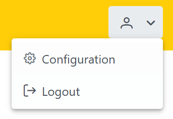

# JSF User Management Dashboard

This is a simple User Management Web Application developed using **Jakarta EE (JSF)**, **PrimeFaces**, and **Chart.js**. It allows you to:

- Add and list users dynamically.
- Navigate between **Dashboard** and **Users** views.
- Display user statistics with a dynamic doughnut chart.

## Features

- **Dashboard View**: Shows a dynamic doughnut chart representing Active and Inactive users using Chart.js.
- **User Management**: Create and view users in a dynamic table.
- **Navigation**: Sidebar with live navigation without page reload using AJAX.
- **Responsive Layout**: Flexbox layout with styled topbar, sidebar, and content section.
- **Dynamic Content**: Pages are loaded dynamically using `ui:include` and managed by a `PageBean`.

## Technologies Used

- Java 17+
- Jakarta EE (JSF)
- PrimeFaces
- Chart.js
- Payara Server 6
- MySQL (as a Database)

## Screenshots

### Dashboard


### Users Page


### Configuration & Logout



## How to Run

1. Clone the repository:

    ```bash
    git clone https://github.com/isma3il-gharsallah/Jakarta_ERP
    cd Jakarta_ERP
    ```

2. Configure the database:
    - Create a MySQL database.
    - Set up a `jdbc/mydb` DataSource in Payara Server.
    - Update your `persistence.xml` if needed.

3. Deploy to Payara Server:
    - Build the project with Maven or directly deploy the WAR file.

4. Access the application at:

    ```
    http://localhost:8080/exercice/
    ```

## Project Structure


## Author

- [Ismail Gharsallah](https://www.linkedin.com/in/isma3il-gharsallah/)

---


